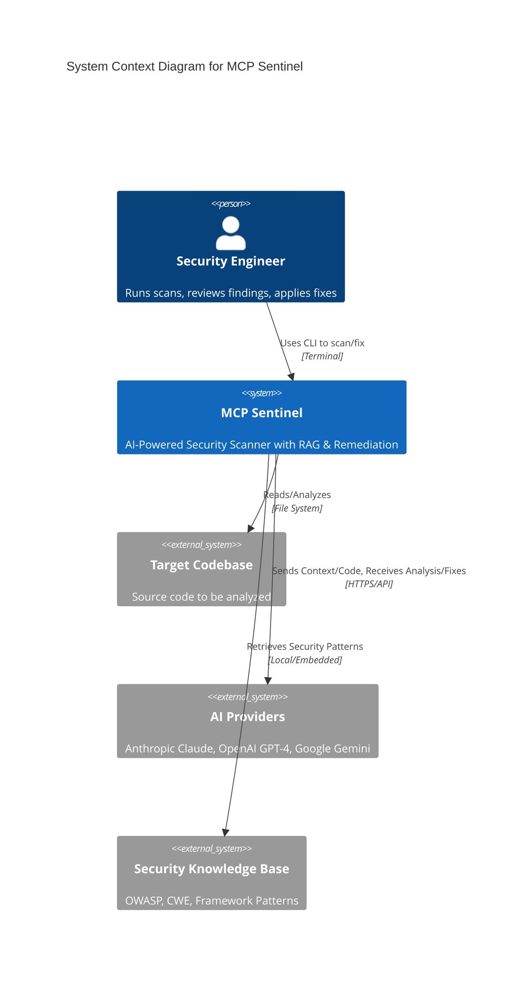
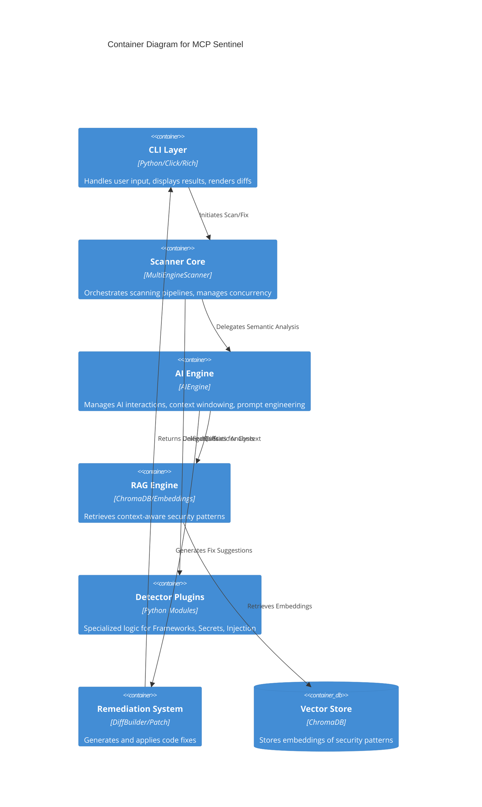
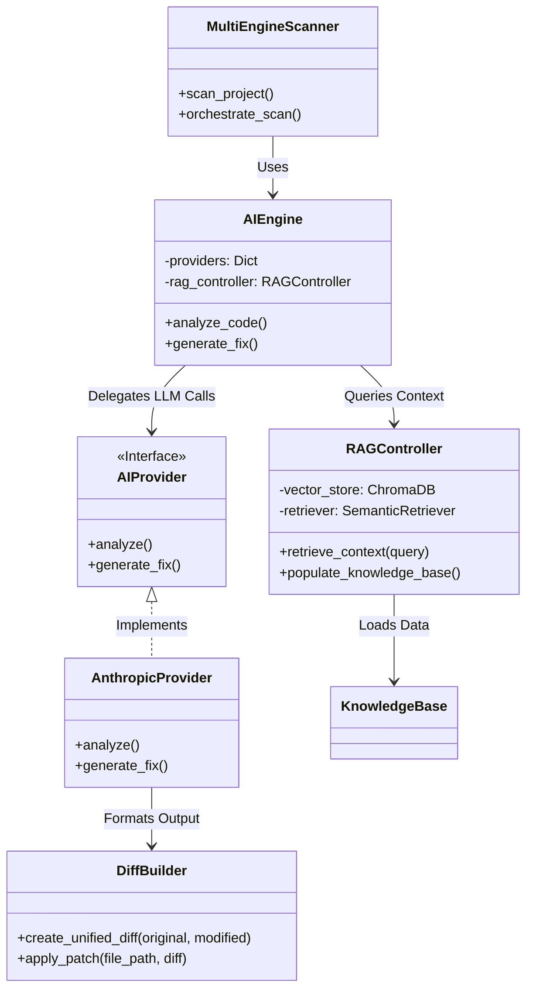
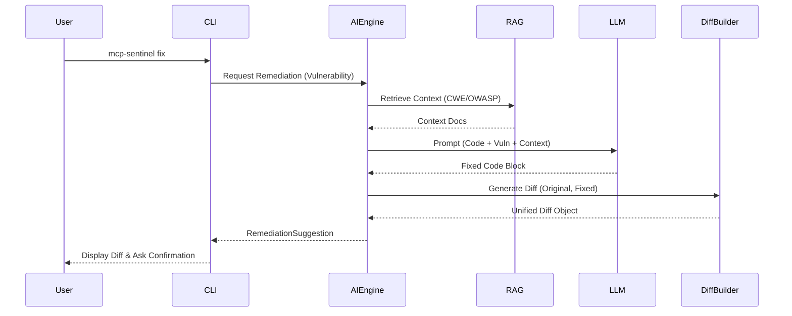
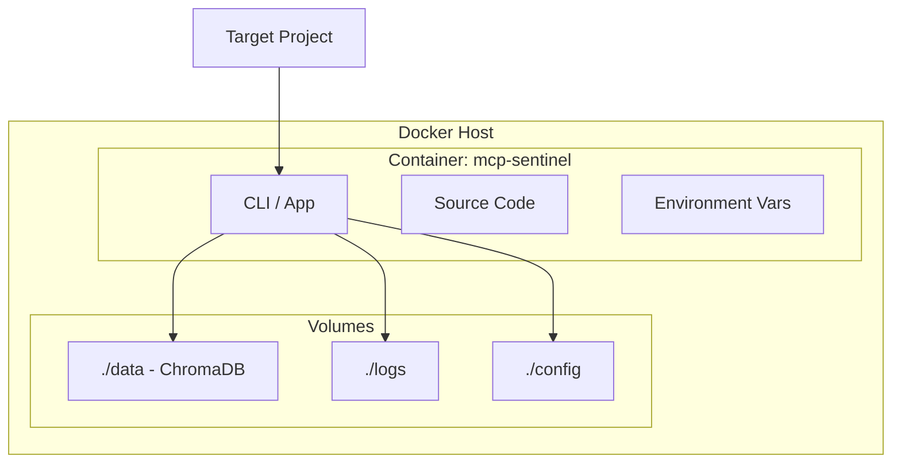

# System Architecture Diagrams

## Overview

This document provides comprehensive architecture diagrams for the MCP Sentinel Python project, using the C4 model and Mermaid.js to illustrate the system's design, component relationships, and data flow. These diagrams reflect the Phase 4.4 architecture, including **RAG (Retrieval-Augmented Generation)** and **Automated Remediation**.

## Table of Contents

1. [System Context (C4 Level 1)](#system-context-c4-level-1)
2. [Container Diagram (C4 Level 2)](#container-diagram-c4-level-2)
3. [Component Diagram - AI & RAG (C4 Level 3)](#component-diagram---ai--rag-c4-level-3)
4. [Remediation Data Flow](#remediation-data-flow)
5. [Deployment Architecture](#deployment-architecture)

---

## System Context (C4 Level 1)

This diagram shows the high-level interactions between the User, MCP Sentinel, and external systems.

## Container Diagram (C4 Level 2)

This diagram breaks down the MCP Sentinel system into its core containers and their interactions.

## Component Diagram - AI & RAG (C4 Level 3)

Detailed view of the AI Engine and its integration with RAG and Remediation.

## Remediation Data Flow

The flow of data when generating an automated fix.

## Deployment Architecture

Deployment view for Docker-based distribution.

