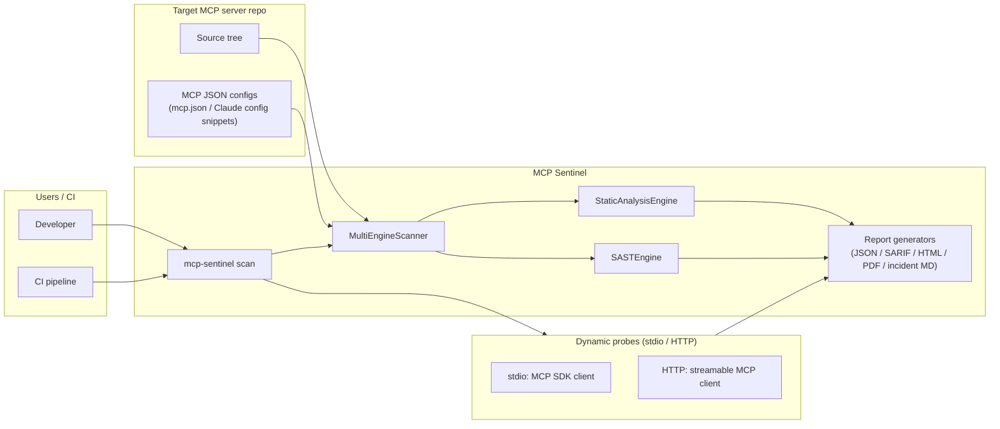
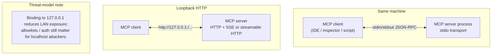
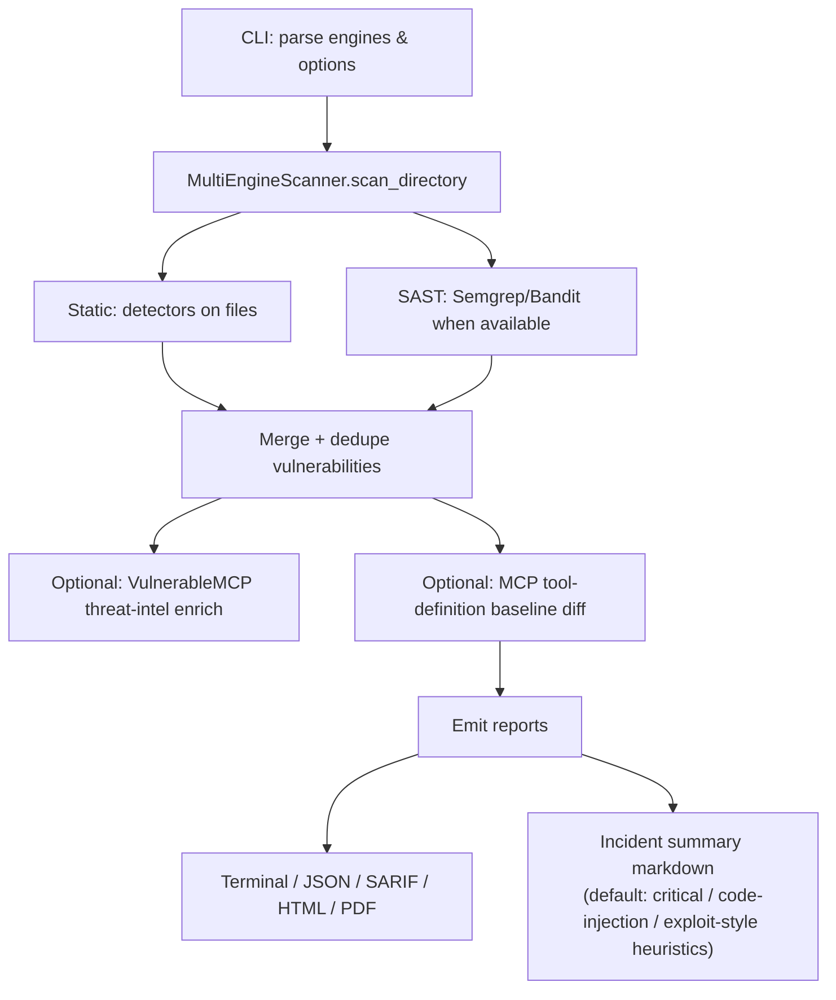

# Reporting, architecture, and scan workflows

This document describes how MCP Sentinel turns a **codebase** into **actionable reports**, how that relates to **transport layers** (stdio vs network MCP), and where **optional lab-style dynamic probing** fits.

---

## System context

**Default:** **`mcp-sentinel scan`** runs **static + SAST**, then (unless ``--probes off``) **discovers MCP server entries from JSON configs** under the target and runs **live probes** (initialize + list_tools/resources/prompts) for each stdio or HTTP server. Findings use ``engine: dynamic``. Use ``mcp-sentinel probe`` for **probe-only** JSON output.

---

## Logical network: MCP transports (reference)

This is not “MCP Sentinel networking,” but the **target server’s** exposure model when you later probe it dynamically:

---

## Internal scan workflow (what `scan` does)

### Incident summary (default-on)

After findings exist, the CLI can write **`\<primary-report-stem\>-incidents.md`** (when `--json-file` is used) or a path you choose via **`--incident-file`**.

---

## Reporting outputs (today)

| Output | Role |
|--------|------|
| JSON | Full machine-readable results; integrates with CI and dashboards |
| SARIF | GitHub Code Scanning and SARIF consumers |
| HTML | Interactive drill-down |
| PDF | Short executive table (truncated rows) |
| Incident MD | **Triage-focused** list for critical / code injection / exploit-style indicators |

---

## Relationship: “static scan” vs “dynamic test”

| Layer | What runs | In core CLI? |
|-------|-----------|----------------|
| Static analysis | Pattern detectors on source | Yes (`static` engine) |
| SAST | Semgrep / Bandit | Yes (`sast` engine) |
| Threat intel | Feed enrichment after scan | Yes (optional network) |
| Dynamic MCP probe | `initialize` + `list_tools` / `list_resources` / `list_prompts` over stdio or HTTP | **Yes** (default ``--probes auto`` on ``scan``; ``mcp-sentinel probe`` for probe-only) |

---

## CLI flags referenced elsewhere

- **`--incident-summary` / `--no-incident-summary`** — turn the incident markdown on or off (default: **on**).
- **`--incident-file PATH`** — explicit output path for the incident summary.
- **`--probes auto|off`** — run or skip live MCP probes after static/SAST (default: **auto**).
- **`--probe-timeout SECONDS`** — per-server probe timeout (default **90**).

These are **overrides**: they change default behavior without editing code.
